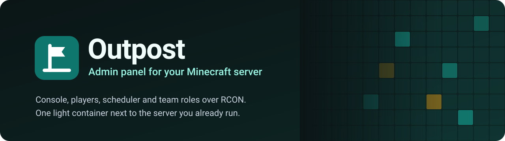
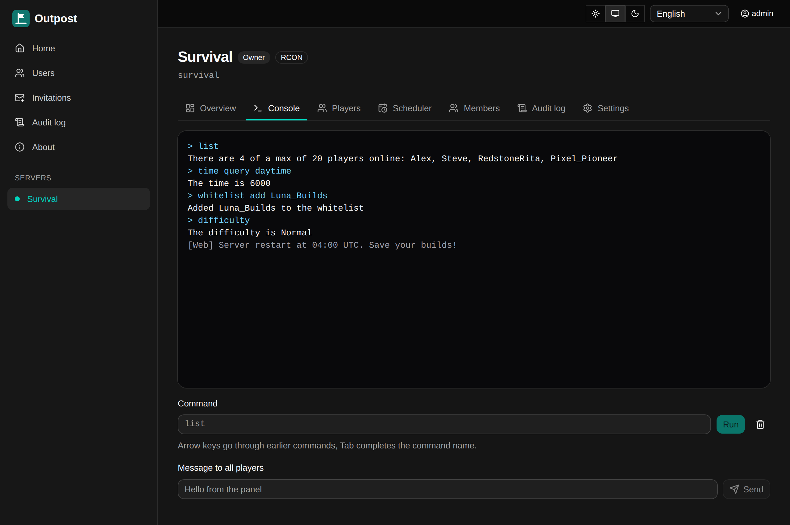
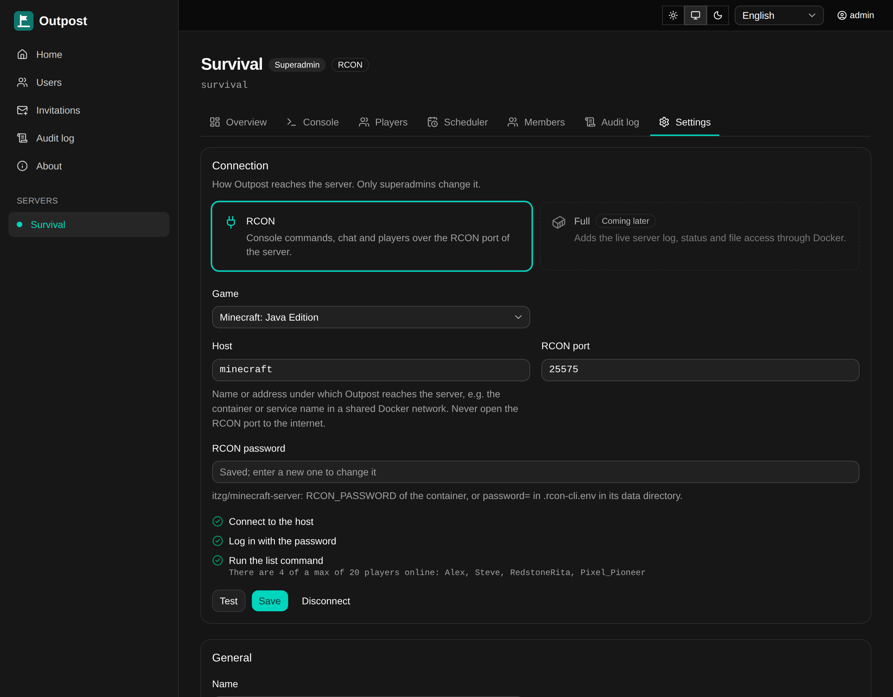
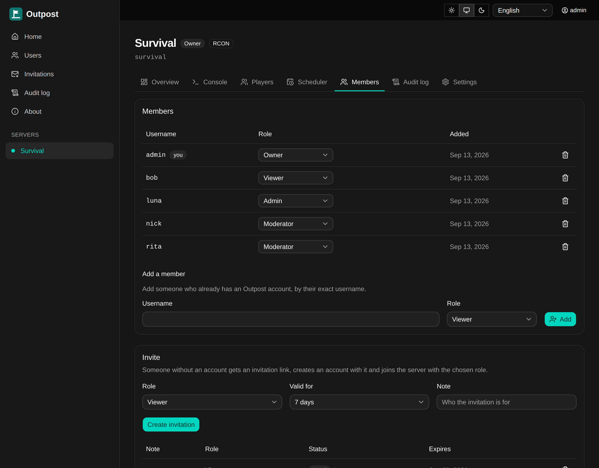

<p align="center">
  
</p>

<p align="center">
  <a href="https://github.com/mobixon/outpost/releases"></a>
  <a href="https://github.com/mobixon/outpost/actions/workflows/ci.yml"></a>
  <a href="LICENSE"></a>
  
  
  <a href="https://github.com/mobixon/outpost/pkgs/container/outpost"></a>
</p>

**Outpost** is a lightweight, self-hosted admin panel for **Minecraft: Java Edition**. It connects
to the server you already run — over **RCON**, and to its **files** from a mounted folder or over
**SFTP** — with nothing to install into the game and no migration into a hosting panel. Your team
gets a web console with the live server log, player management and scheduled tasks, with roles,
two-factor login and an audit log.

<p align="center">
  
</p>

## Why Outpost

- **Made for Minecraft.** A console with command completion and a command history kept in your
  account; players online, history, bans, kicks and operators, aware of offline-mode servers; a
  whitelist that gets the UUIDs right, with a doctor for broken entries; the inventories, ender
  chests, statistics and advancements of players, read from the world; scheduled commands and
  rotating chat announcements; timed **events** such as the weekly top three wood cutters, with
  standings in the chat, notices on joining and rewards.
- **Live log.** The console shows the server log as the server writes it, coloured by level, and
  picks up where it left off after a lost connection. Viewers never see it, since it holds the
  chat and the IP addresses of the players.
- **Connects to what is already there.** RCON drives the console, the players and the scheduler on
  any Java server with RCON on: vanilla, Fabric, Paper or `itzg/minecraft-server`. The server's
  files — a folder mounted into Outpost, or SFTP for servers at a game host — add the live log. No
  plugin, mod or agent on the game server.
- **Light.** One container of about 110 MB that idles at about 70 MB of RAM. SQLite is built in;
  PostgreSQL is optional.
- **Set up in minutes.** Create the administrator with a one-time setup token, add the server and
  press **Test** on each connection: Outpost checks it step by step — the RCON port, password and a
  first command; the folder or the SFTP login, host key and `server.properties` — and says what is
  wrong.
- **Runs next to your server.** Put it into the same Docker network, Compose project or CapRover
  as the game server. RCON stays on the private network and is never exposed to the internet;
  SFTP pins the host key of the server.
- **Built for a team.** Per-server roles (owner, admin, moderator, viewer), invitation links, 2FA
  required for administrators, GitHub and OpenID Connect login, and an audit log of every action.
- English and Russian interface.

<table>
  <tr>
    <td width="50%"></td>
    <td width="50%"></td>
  </tr>
  <tr>
    <td align="center">Connect over RCON and test it step by step</td>
    <td align="center">Invite your team with per-server roles</td>
  </tr>
</table>

> **Version 0.4** runs a real Minecraft server in production and adds events: timed competitions
> with standings, chat commands and rewards. The [project plan](docs/PLAN.md) describes what comes
> next.

## Install next to your server

The quickest start is one Compose project with the game server and Outpost side by side:

```yaml
services:
  minecraft:
    image: itzg/minecraft-server
    restart: unless-stopped
    ports:
      - '25565:25565' # the game port only; RCON stays inside the project
    environment:
      EULA: 'TRUE'
      RCON_PASSWORD: ${RCON_PASSWORD}
    volumes:
      - minecraft-data:/data

  outpost:
    image: ghcr.io/mobixon/outpost:0.4.0
    restart: unless-stopped
    ports:
      - '127.0.0.1:3000:3000'
    environment:
      OUTPOST_SECRET_KEY: ${OUTPOST_SECRET_KEY} # openssl rand -base64 48, keep it
      OUTPOST_PUBLIC_URL: http://localhost:3000
    volumes:
      - outpost-data:/data
      - minecraft-data:/servers/minecraft:ro # the files of the game server, for the live log

volumes:
  minecraft-data:
  outpost-data:
```

1. `docker compose up -d`, then read the setup token with `docker compose logs outpost`.
2. Open <http://localhost:3000>, create the administrator and turn on two-factor authentication.
3. **Add server** → **Settings** → **RCON**: host `minecraft`, port `25575` and the RCON password
   → **Test** → **Save**.
4. **Settings** → **Files**: folder `minecraft` → **Test** → **Save**. The console now shows the
   live log.

Already running a server? Add only the `outpost` service to its Docker network, and mount its data
folder below `/servers` for the live log. A server at a game host connects over RCON and SFTP
instead. A domain with HTTPS, a reverse proxy, CapRover, updates and backups are covered in
[docs/install.md](docs/install.md).

## Documentation

- [Installation](docs/install.md) — Compose, reverse proxy, CapRover, file access, updates, backups
- [Configuration](docs/configuration.md) — all settings
- [Authentication](docs/authentication.md) — accounts, 2FA, invitations, GitHub and OIDC login
- [Servers, connections, roles and modules](docs/servers.md)
- [Roadmap](docs/PLAN.md#18-roadmap-after-v01) — more modules on top of the files (settings
  editor, player history from the log), backups, mods from Modrinth, restarts with warnings,
  statistics and more

## Development

You need Node.js 24 with Corepack (bundled with Node.js), or just Docker:

```sh
# With Node.js
corepack enable
pnpm install
pnpm check

# With Docker only
scripts/in-docker.sh pnpm install
scripts/in-docker.sh pnpm check
```

To build the image yourself: `docker build -t outpost .` See [CONTRIBUTING.md](CONTRIBUTING.md) for
the workflow and conventions.

## Security

Please report vulnerabilities privately — see [SECURITY.md](SECURITY.md).

## License

[MIT](LICENSE)
