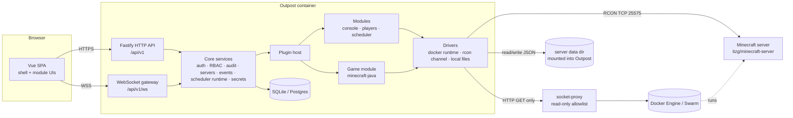

# Outpost — Project Plan (v0.1 / MVP)

> Status: **approved** · Date: 2026-09-12 · Revised: 2026-09-13 (D20: v0.1 connects over RCON
> only) · Owner: @mobixon
>
> Outpost is an open-source, modular web admin panel for game servers.
> The first supported game is **Minecraft: Java Edition**.

---

## 1. Vision

A self-hosted panel that **attaches to game servers however they are already run** (plain Docker,
Docker Compose, Docker Swarm / CapRover, and later systemd or bare processes) instead of forcing
users to migrate into a proprietary hosting model. Everything game-specific or feature-specific is a
**module** written against one public Plugin API, so new games and features can be added without
touching the core.

### 1.1 Goals for v0.1 (MVP)

- Attach to existing Minecraft Java servers over **RCON**, however they are run (Docker, CapRover,
  bare metal); the full connection through Docker follows after v0.1 (D20).
- **Console**: commands and chat messages with the replies (the live server log comes with the
  full connection).
- **Players**: online list, history, whitelist, ops, bans, kick — over RCON.
- **Scheduler**: cron-scheduled commands and rotating chat announcements.
- **Multi-user**: several users, per-server roles built on a permission system, audit log.
- **Secure by default**: argon2id passwords, TOTP 2FA, OIDC/GitHub login, RCON kept off the internet.
- **Easy to install**: one Docker image, SQLite by default.
- EN + RU user interface.
- Light + Dark theme(remember for user or in local storage for public auth page)

### 1.2 Non-goals for v0.1 (see [Roadmap](#15-roadmap-after-v01))

Start/stop/restart and CPU/RAM/TPS metrics, file manager and `server.properties` editor, backups,
mod management, scheduled restarts, statistics and notifications, custom role editor, loading
third-party plugins at runtime, multi-host agents, games other than Minecraft Java, creating servers
from the panel.

---

## 2. Decision log

| #   | Topic                       | Decision                                                                                                                                                                                                                                                                                                                                                                                                                                                    | Why                                                                                                                                                                                           |
| --- | --------------------------- | ----------------------------------------------------------------------------------------------------------------------------------------------------------------------------------------------------------------------------------------------------------------------------------------------------------------------------------------------------------------------------------------------------------------------------------------------------------- | --------------------------------------------------------------------------------------------------------------------------------------------------------------------------------------------- |
| D1  | Control model               | **Core + drivers**: runtime driver (Docker) + command channel (RCON) + file access                                                                                                                                                                                                                                                                                                                                                                          | Works with servers users already run (incl. CapRover); creating servers / agents can be added later as more drivers                                                                           |
| D2  | Stack                       | **TypeScript** end-to-end, Node.js 24 LTS                                                                                                                                                                                                                                                                                                                                                                                                                   | One language, modules as npm packages, first-class WebSocket; lowest barrier for contributors                                                                                                 |
| D3  | Modularity                  | **Monorepo**; built-in modules use the same public Plugin API that third-party plugins will use later                                                                                                                                                                                                                                                                                                                                                       | Keeps the API honest without committing to a stable external ABI in v0.1                                                                                                                      |
| D4  | Scale                       | Many servers, many users, per-server roles, global superadmin, audit log                                                                                                                                                                                                                                                                                                                                                                                    | Expected minimum for a public product                                                                                                                                                         |
| D5  | MVP features                | Console, Players, Scheduler (cron commands + announcements)                                                                                                                                                                                                                                                                                                                                                                                                 | Owner's priority                                                                                                                                                                              |
| D6  | Externally managed settings | **Hybrid with locks**: settings controlled by container ENV are shown locked with the reason                                                                                                                                                                                                                                                                                                                                                                | Nothing gets silently overwritten on restart                                                                                                                                                  |
| D7  | Login                       | Local accounts (argon2id) + TOTP 2FA + backup codes; generic **OIDC** and **GitHub** login                                                                                                                                                                                                                                                                                                                                                                  | Standard for self-hosted admin tools                                                                                                                                                          |
| D8  | Console source              | **Docker logs** through a **read-only socket proxy**                                                                                                                                                                                                                                                                                                                                                                                                        | Full output incl. startup/crashes; `inspect` gives ENV needed for D6; not root-equivalent                                                                                                     |
| D9  | Player data                 | RCON + panel's own history parsed from logs + direct JSON writes where safe                                                                                                                                                                                                                                                                                                                                                                                 | Fixes the offline-mode UUID problem; enables player cards                                                                                                                                     |
| D10 | Database                    | **SQLite by default**, optional **PostgreSQL** via `DATABASE_URL`; Kysely query builder                                                                                                                                                                                                                                                                                                                                                                     | Zero-config self-hosting, scalable option                                                                                                                                                     |
| D11 | Backend                     | **Fastify 5** + own framework-agnostic Plugin API                                                                                                                                                                                                                                                                                                                                                                                                           | Light, fast, encapsulated plugins, good WS support                                                                                                                                            |
| D12 | License                     | **MIT**                                                                                                                                                                                                                                                                                                                                                                                                                                                     | Maximum adoption                                                                                                                                                                              |
| D13 | Name                        | **Outpost** — repo `github.com/mobixon/outpost`, image `ghcr.io/mobixon/outpost`                                                                                                                                                                                                                                                                                                                                                                            | Name checked free on GitHub; unscoped npm `outpost` is taken → scoped npm packages when an SDK is published                                                                                   |
| D14 | UI languages                | EN (default) + RU via `vue-i18n`; modules ship their own messages                                                                                                                                                                                                                                                                                                                                                                                           | Community can add locales                                                                                                                                                                     |
| D15 | UI kit                      | **shadcn-vue components on Reka UI + Tailwind CSS** (MIT), kept in `@outpost/ui`; Lucide icons; light/dark theme                                                                                                                                                                                                                                                                                                                                            | Components live in our repo, plugins use our `@outpost/ui` API; PrimeVue was dropped because v5 became proprietary (license key, OEM clause)                                                  |
| D16 | Roles                       | Built-in role presets (owner/admin/moderator/viewer) defined as permission sets; role editor later                                                                                                                                                                                                                                                                                                                                                          | Data model ready for custom roles                                                                                                                                                             |
| D17 | Server onboarding           | **Wizard + autodiscovery** of Docker containers/services, manual add also possible                                                                                                                                                                                                                                                                                                                                                                          | Beginners avoid misconfiguration                                                                                                                                                              |
| D18 | EasyAuth integration        | Roadmap — first post-MVP module                                                                                                                                                                                                                                                                                                                                                                                                                             | Also validates the Plugin API on a real case                                                                                                                                                  |
| D19 | Workflow                    | **Each stage = branch + PR with CI**, owner merges                                                                                                                                                                                                                                                                                                                                                                                                          | Clean public history, review per stage                                                                                                                                                        |
| D20 | Connection in v0.1          | **RCON only.** The server settings offer the connection types **RCON** (implemented) and **Full** (Docker, live log, files — shown as coming later)                                                                                                                                                                                                                                                                                                         | Shorter MVP (owner's decision at Stage 4). Replaces D8, D17 and the file part of D9 for v0.1; they move to the roadmap as the full connection                                                 |
| D21 | Release v0.1                | **Minimal release** (2026-09-13): tag → GHCR image (amd64) + GitHub Release, install docs; pre-release `v0.1.0-rc.1` tested on the maintainer's server before `v0.1.0`                                                                                                                                                                                                                                                                                      | Owner wants to test in production soon. Security review, extended e2e, release-please, `edge` and arm64 images, SBOM/signing and full docs move to the roadmap                                |
| D22 | Connectors                  | **Connectors instead of connection types** (2026-09-13): RCON, **Files** (sources: a folder mounted into Outpost below `OUTPOST_FILES_ROOT`, then SFTP), later an optional Docker connector. Each connector is tested and saved on its own; the capabilities of a server are the union of what its connectors add; modules check capabilities only. Replaces the "Full" connection of D20                                                                   | Owner: what matters is what a connector provides, not its type. File access through the Docker API was judged too complex; SFTP covers servers on game hosts; keeping it easy for other users |
| D23 | Games                       | **A server is of one game, chosen when it is added and never changed** (2026-09-13). The chain is server/game → connectors → capabilities → modules. Modules declare `games` (none = any game); the core hides their tabs and refuses their server routes for other games. Players, Console and Scheduler are Minecraft-only for now; later most games get their own modules (e.g. players and console per game). The `plugins/` folder holds these modules | Owner's decision: modules depend on the game, so changing it would leave a server with modules that do not fit                                                                                |

Defaults chosen without a separate question (conventional choices, can be revisited in review):
pnpm workspaces · ESM · Vue 3 + Vite + Vue Router + Pinia · zod schemas shared by server and web ·
OpenAPI generated from zod · pino logging · Vitest + Testcontainers + Playwright · ESLint + Prettier ·
Conventional Commits · Dependabot · CodeQL (release-please and the multi-arch image moved to the
roadmap with D21).

---

## 3. Architecture

### 3.1 Components



### 3.2 Core concepts

- **Server** — a game server registered in Outpost: name, game module, runtime binding, command
  channel binding, file access binding, members.
- **Runtime driver** — how Outpost observes (and later controls) the process. v0.1: `docker`
  (plain containers and Swarm services). Interface already includes lifecycle/metrics methods that
  return `NotSupported` until implemented.
- **Command channel** — how Outpost sends commands. v0.1: `rcon`.
- **File access** — how Outpost reads/writes server files. v0.1: `local` (a directory mounted into
  the Outpost container), sandboxed to the server root.
- **Game module** — knows a specific game: detection, log parsing into typed events, player
  management, managed-settings (lock) rules.
- **Feature module** — a user-facing feature (console, players, scheduler) that works against
  capabilities, not concrete games.
- **Capability** — what a server can do given its drivers + game module (`logs.stream`,
  `commands.send`, `players.manage`, `files.rw`, `lifecycle.control`, …). The UI shows tabs/actions
  only when the needed capabilities and permissions are present.
- **Event bus** — typed in-process events (`log.line`, `game.player.joined`, `game.chat`,
  `server.status`, `task.run.finished`, …) consumed by modules and forwarded to WebSocket
  subscribers.

### 3.3 Process model

Single Node.js process in v0.1 (API + WS + scheduler + driver connections). Per-server supervisors
own the Docker log stream and the RCON connection, with reconnection and backoff. The design keeps
drivers behind interfaces so a later **agent** process (multi-host) can implement the same
interfaces over the network.

---

## 4. Repository layout

```
outpost/
├─ apps/
│  ├─ server/              # Fastify app: bootstrap, config, core services, plugin host, DB, migrations
│  └─ web/                 # Vue SPA shell: layout, auth pages, server list, module slots
├─ packages/
│  ├─ plugin-api/          # PUBLIC contracts: definePlugin, driver/game/capability interfaces, event types
│  ├─ web-plugin-api/      # PUBLIC contracts for UI modules: defineWebPlugin, slots, composables
│  ├─ shared/              # zod schemas + types shared by server and web (API DTOs, permissions)
│  └─ ui/                  # shared UI kit: shadcn-vue components (Reka UI), theme, cn(); later LogView, CronInput…
├─ plugins/               # the modules (plugins in the code: definePlugin); later mostly one per game
│  ├─ driver-docker/       # Docker runtime driver + autodiscovery
│  ├─ channel-rcon/        # Source RCON protocol client
│  ├─ files-local/         # Sandboxed local file access
│  ├─ game-minecraft/      # Minecraft Java game module (log parser, UUIDs, itzg rules, players impl)
│  ├─ console/             # Live console module (server + web parts)
│  ├─ players/             # Players module (generic UI over players.manage capability)
│  └─ scheduler/           # Scheduler module
├─ e2e/                    # Playwright tests
├─ deploy/
│  ├─ compose/             # docker-compose examples (single server, strict proxy)
│  └─ caprover/            # CapRover instructions / templates
├─ docs/                   # Markdown documentation (this plan, install, config, security, plugin guide)
├─ .github/                # CI workflows, issue/PR templates, dependabot, CODEOWNERS
├─ Dockerfile
├─ LICENSE (MIT) · README.md · CONTRIBUTING.md · SECURITY.md · CODE_OF_CONDUCT.md · CHANGELOG.md
└─ package.json · pnpm-workspace.yaml · tsconfig.base.json
```

Rules: plugins import only from `@outpost/plugin-api`, `@outpost/web-plugin-api`, `@outpost/shared`
and `@outpost/ui` — never from `apps/*`. An ESLint rule enforces this so built-in modules prove the
public API is sufficient.

---

## 5. Plugin API (v1, internal-stable)

### 5.1 Server side

```ts
import { definePlugin } from '@outpost/plugin-api';

export default definePlugin({
  id: 'outpost.players',
  version: '0.1.0',
  apiVersion: 1,
  dependsOn: ['outpost.game-minecraft?'],          // "?" = optional
  permissions: [
    { key: 'players.view', scope: 'server' },
    { key: 'players.kick', scope: 'server' },
    // ...
  ],
  migrations: [createPlayerTables],               // in order, once; same code for SQLite and PG
  settingsSchema: z.object({ /* per-server module settings */ }),

  async setup(ctx) {
    ctx.http.serverRoutes((r) => {                 // mounted at /api/v1/servers/:serverId/players
      r.get('/', { permission: 'players.view', schema: {...} }, handler);
    });
    ctx.events.on('game.player.joined', async (e) => { /* history */ });
    ctx.ws.channel('players', { permission: 'players.view' });
    ctx.scheduler.registerTaskType({...});         // used by the scheduler module
  },
});
```

`ctx` exposes: `http`, `ws`, `events`, `db` (Kysely access to the plugin's own tables), `kv` (small JSON key-value store), `servers`
(lookup + capabilities), `audit.log()`, `permissions.check()`, `secrets` (encrypt/decrypt),
`logger`, `config`, `i18n` (server-side messages), `scheduler`.

### 5.2 Driver / game contracts (simplified)

```ts
interface RuntimeDriver {
  id: string; // 'docker'
  discover?(): Promise<DiscoveredTarget[]>;
  describe(target): Promise<RuntimeInfo>; // image, labels, env, mounts, state, health
  logs(target, o: { tail?: number; since?: Date }): AsyncIterable<LogLine>; // follows, survives restarts
  status(target): Promise<RuntimeStatus>;
  // v0.2+: start/stop/restart/stats → capability 'lifecycle.control' / 'metrics.runtime'
}

interface CommandChannel {
  send(cmd: string): Promise<string>;
  readonly state: ChannelState;
}

interface FileAccess {
  // all paths relative to the server root
  read(path): Promise<Buffer>;
  write(path, data, o?: { atomic?: boolean }): Promise<void>;
  stat(path): Promise<FileStat | null>;
  list(dir): Promise<FileEntry[]>;
}

interface GameModule {
  id: string; // 'minecraft-java'
  detect(info: RuntimeInfo): Detection | null; // autodiscovery scoring + prefilled config
  parseLogLine(line: LogLine): GameEvent | null;
  players?: PlayerManagement; // provides capability 'players.manage'
  managedSettings?(server): Promise<ManagedSetting[]>; // locks (D6)
}
```

### 5.3 Web side

```ts
export default defineWebPlugin({
  id: 'outpost.players',
  serverTabs: [{ key: 'players', label: 'players.tab', icon: 'pi pi-users',
                 component: () => import('./PlayersTab.vue'),
                 permission: 'players.view', capability: 'players.manage' }],
  routes: [...], navItems: [...],
  messages: { en, ru },
});
```

In v0.1 web modules are bundled into the SPA at build time; the server exposes
`GET /api/v1/plugins` (enabled modules, their permissions/capabilities) so the UI renders only what is
enabled. Runtime loading of external plugins is a roadmap item (needs a signed/versioned bundle
format and a trust model).

---

## 6. Minecraft Java module (`game-minecraft`)

> **v0.1 (D20):** servers are connected over RCON only. Detection (6.1), log parsing (6.2), the
> file-based parts of 6.3 and the live log of 6.4 belong to the full connection on the roadmap;
> v0.1 uses the RCON parts: commands, `list`, whitelist, ops, bans and kicks through RCON.

Facts below were verified against a live server (Minecraft 26.2, Fabric, itzg image) in September 2026.

### 6.1 Detection (autodiscovery)

Score a Docker container/service as Minecraft Java if (strongest first):

1. label `outpost.game=minecraft-java` (explicit opt-in);
2. image label `org.opencontainers.image.source=https://github.com/itzg/docker-minecraft-server`
   — **inherited by derived images** (confirmed on a custom image built `FROM itzg/minecraft-server`);
3. image name contains `itzg/minecraft-server`;
4. ENV contains `EULA` and `TYPE`/`VERSION`.

Swarm services are listed instead of their task containers (task container names change on every
restart, e.g. `srv-captain--mc.1.<taskId>`; the driver resolves the current task by the label
`com.docker.swarm.service.name`).

Prefill from `inspect`: RCON port (`RCON_PORT`, default 25575), RCON password (`RCON_PASSWORD`,
otherwise read `password=` from `.rcon-cli.env` in the data dir — itzg generates it), RCON host
(service/container DNS name on the shared network), the container's `/data` mount (shown as a
hint for which host path must be mounted into Outpost).

### 6.2 Log parsing

Line envelope: Docker timestamp (full date) + vanilla/Fabric prefix
`[HH:MM:SS] [Thread/LEVEL]: message`; Paper-style `[HH:MM:SS LEVEL]: message` also supported.

| Event                   | Pattern (message part)                                               | Example                                                     |
| ----------------------- | -------------------------------------------------------------------- | ----------------------------------------------------------- |
| `player.login` (IP)     | `^(?<name>\S+)\[/(?<ip>[^\]]+):\d+\] logged in with entity id`       | `Steve[/x.x.x.x:port] logged in with entity id 21 at (…)`   |
| `player.joined`         | `^(?<name>\S+) joined the game$`                                     | `Alex joined the game`                                      |
| `player.left` (+reason) | `^(?<name>\S+) lost connection: (?<reason>.*)$` then `left the game` | `Steve lost connection: §cAuthentication time has expired.` |
| `chat`                  | `^(?:\[Not Secure\] )?<(?<name>[^>]+)> (?<msg>.*)$`                  | `[Not Secure] <Alex> hello`                                 |
| `server.started`        | `^Done \([\d.]+s\)! For help, type "help"`                           |                                                             |
| `server.stopping`       | `^Stopping (the )?server`                                            |                                                             |

The parser is a table of rules with fixture-based unit tests (real log samples per version/loader);
unknown lines are still shown in the console, they just produce no event. Mods can change chat
formats — the rule table is extendable per server in a later version.

### 6.3 Players and the offline-mode UUID problem

Background: in `online-mode=false` a player's UUID is `UUIDv3(MD5("OfflinePlayer:" + name))`.
Vanilla resolves names for `/whitelist add`, `/ban`, `/op` from `usercache.json` first and falls
back to the **Mojang API**, which returns the _online_ UUID for players who have never joined — the
entry then never matches. This was observed on a live server: a never-joined player was whitelisted with a v4 (online)
UUID and could not join.

Strategy (serialized per server with a mutex):

| Operation                 | online-mode=true                                                | online-mode=false                                                                                                                          |
| ------------------------- | --------------------------------------------------------------- | ------------------------------------------------------------------------------------------------------------------------------------------ |
| Whitelist add/remove      | RCON `whitelist add/remove`                                     | Atomic read-modify-write of `whitelist.json` with the offline UUID, then RCON `whitelist reload`                                           |
| Whitelist on/off, enforce | RCON `whitelist on/off` (locked if ENV-managed, §7)             | same                                                                                                                                       |
| Ban / unban / op / deop   | RCON                                                            | RCON if the player is in `usercache.json`; otherwise a **pending action** applied via RCON the moment the player's join is seen in the log |
| Ban IP                    | RCON `ban-ip`                                                   | same                                                                                                                                       |
| Kick                      | RCON `kick <name> <reason>`                                     | same                                                                                                                                       |
| Online list               | RCON `list uuids` (poll 30 s) + join/leave events for real time | same                                                                                                                                       |

`ops.json` / `banned-*.json` are **never written while the server runs** (vanilla has no reload
command for them and would overwrite the files). A **UUID doctor** flags whitelist entries whose UUID
does not match the server mode and offers a one-click fix.

History (panel DB, built from log events): first/last seen, last IP, per-session join/leave with
reason, total playtime. Player card: skin head (by name via a public skin service, configurable/
disableable for privacy), status badges (online, whitelisted, op, banned), sessions table, actions.

Offline-mode UUID rules and pending actions get **integration tests against a real itzg container**
(vanilla, offline mode) in CI, because this behavior differs between versions.

### 6.4 Console

- Output: Docker log stream → ring buffer (last 2 000 lines per server, in memory) → WebSocket.
  On connect the client gets the buffer, then live lines. Reconnects follow Swarm task restarts.
- Rendering: virtualized list; ANSI and `§` color codes rendered as styled spans; level coloring;
  filter (text/level/chat only); pause autoscroll; copy.
- Input: command line with history (per user, local) and completion for vanilla commands + online
  player names. Commands go through RCON; the RCON reply is shown inline, marked as RCON output.
- Chat from the panel: `tellraw @a` with a `[Web] <user>:` prefix (permission `chat.send`,
  separate from arbitrary `console.execute`).
- Every command is written to the audit log.

### 6.5 RCON client (`channel-rcon`)

Own implementation of the Source RCON protocol (small, fully tested): auth, one in-flight command at
a time via a queue, multi-packet responses via the empty-sentinel-packet technique, request size
limit (~1446 bytes) validation, timeouts, reconnect with exponential backoff, no retry on auth
failure (surface a clear error in the UI).

---

## 7. Managed settings (hybrid locks, D6)

> **Roadmap (D20):** the locks need the container's ENV from Docker, so they arrive with the full
> connection.

For itzg-based servers Outpost computes which `server.properties` keys are controlled by container
ENV and therefore would be overwritten on restart:

1. Vendor itzg's `files/property-definitions.json` (property → ENV name), pinned to an itzg commit,
   with a script to refresh it.
2. `SKIP_SERVER_PROPERTIES=true` → nothing is locked. `OVERRIDE_SERVER_PROPERTIES=false` → ENV only
   applies on first setup → nothing locked, show "initial value from ENV".
3. Otherwise a key is locked when its ENV variable is set in the container.
4. **Derived variables** (from itzg's `start-setupServerProperties`): `ENABLE_WHITELIST`, `WHITELIST`
   or `WHITELIST_FILE` force `white-list=true` **and** `enforce-whitelist=true`, so
   `ENFORCE_WHITELIST=false` next to `ENABLE_WHITELIST=true` has no effect (confirmed on a live
   server). Outpost shows such conflicts as a config hint.
5. `CUSTOM_SERVER_PROPERTIES` → lock the listed keys.

In v0.1 locks are used by the **server overview** (read-only settings list with lock badges and
hints) and the whitelist toggles. The full properties editor (roadmap) reuses the same service.
Non-itzg servers: nothing is locked unless the user marks keys manually (roadmap).

---

## 8. Scheduler module

- Task types v0.1: **command** (up to 20 console commands, run back to back — no pauses between
  them; steps with pauses for a restart with warnings stay on the roadmap, decided 2026-09-13) and
  **announcement** (rotating list of messages sent with `tellraw`, one per run, `&` color codes with
  a preview in the UI). Besides `scheduler.manage`, command tasks need `console.execute` and
  announcements `chat.send`, so a task never does more than its author could do by hand.
- Schedule: five-field cron expression with a human-readable preview (`cronstrue`) and the next 5
  runs; per-task time zone (default: the browser's zone at creation time). Library: `croner`.
- Options: enabled, "only when players are online". A run is skipped while the previous run of
  the same task is still going.
- Missed runs while Outpost was down are skipped, not replayed.
- If RCON is unavailable the run is recorded as `skipped` with a reason.
- Run history (status, trigger, output), keep last 100 runs per task; the output is shown to users
  who manage tasks. "Run now" button.
- Task types are built into the scheduler module in v0.1; `ctx.scheduler.registerTaskType` for
  other modules comes with the first module that needs it (e.g. restart-with-warnings, backups).

---

## 9. Users, auth and RBAC

### 9.1 Authentication

- **First run**: no users → `/setup` page; a one-time setup token is printed to the container log
  and required to create the first superadmin (prevents drive-by takeover of a fresh install).
- **Local accounts**: argon2id (`@node-rs/argon2`), password policy (min length + breached-password
  check optional/offline list), login rate limit per IP and per account with progressive delay.
- **Sessions**: server-side session table, opaque ID in `HttpOnly; Secure; SameSite=Lax` cookie,
  idle timeout 7 days, absolute 30 days, list/revoke sessions in profile. **Sudo mode**
  (re-authentication) for sensitive actions: changing 2FA, email/password, roles, deleting servers.
- **TOTP 2FA** (`otplib`) + 10 single-use backup codes (hashed). 2FA can be required per role;
  default: required for superadmins and owners.
- **OIDC** (generic, `openid-client`) and **GitHub** OAuth. Accounts are linked explicitly from the
  profile, or auto-provisioned only when allowed by config (allowlist of emails/domains/GitHub orgs).
  External login does not bypass a required 2FA unless the provider asserts MFA (`amr`) and the
  admin enables trusting it.
- **Invitations**: superadmin/owner creates an invite link (expires, single use) with a preset role.
- CSRF: SameSite cookies + required custom header on mutating requests + Origin check (also on WS).
- Security headers (CSP, frame-ancestors none, etc.) via `@fastify/helmet`.
- Secrets at rest (RCON passwords, TOTP secrets, OIDC client secrets) encrypted with AES-256-GCM
  using `OUTPOST_SECRET_KEY`.

### 9.2 Permissions and built-in roles

Global: `superadmin` flag (all permissions, manages users, creates servers, instance settings).

| Permission (server scope)                     | owner | admin | moderator | viewer |
| --------------------------------------------- | :---: | :---: | :-------: | :----: |
| `server.view`                                 |   ✓   |   ✓   |     ✓     |   ✓    |
| `server.manage` (connection settings, delete) |   ✓   |       |           |        |
| `members.manage`                              |   ✓   |  ✓¹   |           |        |
| `console.read`                                |   ✓   |   ✓   |     ✓     |   ✓    |
| `console.execute` (any command)               |   ✓   |   ✓   |           |        |
| `chat.send`                                   |   ✓   |   ✓   |     ✓     |        |
| `players.view`                                |   ✓   |   ✓   |     ✓     |   ✓    |
| `players.kick`                                |   ✓   |   ✓   |     ✓     |        |
| `players.ban`                                 |   ✓   |   ✓   |     ✓     |        |
| `players.whitelist`                           |   ✓   |   ✓   |     ✓     |        |
| `players.op`                                  |   ✓   |   ✓   |           |        |
| `scheduler.view`                              |   ✓   |   ✓   |     ✓     |   ✓    |
| `scheduler.manage`                            |   ✓   |   ✓   |           |        |
| `audit.view`                                  |   ✓   |   ✓   |           |        |

¹ admins can add/remove moderators and viewers only.

Permissions are declared by modules; roles are stored in the DB (`roles` table seeded with the
built-in presets, `builtin=true`), so the custom role editor later is UI-only work.

### 9.3 Audit log

Every mutating action and every console command: time, user, server, action key, target, details
(JSON), IP. Filterable view per server (`audit.view`) and globally (superadmin). Retention setting
(default 180 days).

---

## 10. Data model (v0.1)

Core tables (SQLite or PostgreSQL through Kysely):

- `users` (id, username, email, password_hash?, is_superadmin, locale, totp_secret_enc?,
  totp_enabled_at?, disabled_at?, created_at)
- `user_backup_codes` (user_id, code_hash, used_at?)
- `user_identities` (user_id, provider, subject, email?, created_at) — OIDC/GitHub links
- `sessions` (id_hash, user_id, mfa_passed, ip, user_agent, created_at, last_seen_at, expires_at)
- `invitations` (token_hash, created_by, is_superadmin, note?, expires_at, used_by?, used_at?,
  server_id?, role_key?)
- `roles` (key, rank, builtin, permissions JSON for custom roles; built-in roles take theirs from
  the permission registry, where the core and plugins declare which roles have a permission)
- `servers` (id, slug, name, created_at; Stage 4 adds game, runtime JSON, channel JSON with
  encrypted secret, files JSON, settings JSON)
- `server_members` (server_id, user_id, role_key)
- `audit_log` (id, at, user_id?, server_id?, action, target?, details JSON, ip?)
- `plugin_kv` (plugin_id, scope — empty or a server id, key, value JSON, updated_at)

Module tables (namespaced by plugin):

- players: `mc_players` (server_id, uuid, name, first_seen, last_seen, last_ip, playtime_s),
  `mc_player_sessions` (server_id, uuid, joined_at, left_at?, ip, leave_reason?),
  `mc_pending_actions` (server_id, name, action, args JSON, created_by, created_at, applied_at?)
- scheduler: `sched_tasks` (id, server_id, name, type, cron, timezone, lines JSON, enabled,
  only_with_players, next_index, created_by, created_at, updated_at), `sched_runs` (task_id,
  trigger, status, reason, output, triggered_by, started_at, finished_at)

Dual-dialect approach: **Kysely** (a typed SQL query builder) instead of an ORM, because one
query and one migration code path works on both databases (Drizzle needs a schema and queries
per dialect). Migrations are TypeScript objects (`{ name, up(db, { dialect, types }) }`) listed in
order by the core and by each plugin; the table `outpost_migrations (scope, name, applied_at)`
records what ran, and every migration runs in a transaction. Column types are limited to what
behaves the same on both: text, integer, `types.timestamp` (BIGINT epoch ms), `types.json` (text)
and `types.boolean` (0/1); ids are generated by the application. CI runs the database tests on
SQLite and PostgreSQL. SQLite runs in WAL mode.

---

## 11. HTTP & WebSocket API

REST under `/api/v1`, JSON, zod-validated, OpenAPI at `/api/v1/openapi.json` (docs UI in dev).
Errors: `{ error: { code, message, details? } }` with proper status codes.

- `GET /healthz`, `GET /readyz`
- Setup/auth: `GET|POST /setup`, `POST /auth/login`, `POST /auth/2fa`, `POST /auth/logout`,
  `POST /auth/providers/:provider/start` (returns the provider URL),
  `GET /auth/providers/:provider/callback`, `GET /invite/:token`, `POST /invite/:token/accept`,
  `GET /me`, `/me/password`, `/me/2fa/*`, `/me/sessions`, `/me/identities`
- Admin: `/users`, `/invitations`, `/roles` (read-only in v0.1), `/audit`
- Servers: `GET|POST /servers`, `GET|PATCH|DELETE /servers/:id`, `/servers/:id/members`,
  `/servers/:id/invitations`, `GET /servers/:id/audit`,
  `GET /servers/:id/overview` (status, version, settings with locks), `POST /servers/:id/test`
  (checks runtime, RCON and file access), `GET /discovery`
- Modules: `/servers/:id/plugins/<plugin id>/*` (e.g. console, players, tasks), registered with
  `ctx.http.serverRoute({ permission, capability?, … })`
- `GET /plugins` — enabled modules, permissions, capabilities per server

WebSocket `/api/v1/ws` (cookie auth + Origin check), multiplexed:
`{"op":"sub","ch":"server.<id>.console"}` → `{"ch":…, "ev":"line", "data":{…}}`.
Channels: `console`, `players`, `status`, `tasks`. Permission checked on subscribe and re-checked
when roles change (server pushes `unsub`).

---

## 12. Web UI

- Layout: sidebar (servers list with status dots, admin section), top bar (user menu, language,
  theme). Responsive down to phone width (moderators on mobile).
- Pages: Login, 2FA, Setup, Profile (password, 2FA, sessions, linked accounts), Admin → Users,
  Invitations, Audit; Server → Overview, Console, Players, Scheduler, Members, Settings (connection).
- **Add server wizard**: 1) pick a discovered target or "manual" → 2) connection (prefilled RCON,
  files path) → 3) "Test" (runtime ✓ / RCON ✓ / files ✓ with actionable errors) → 4) name + members.
- Empty/error states explain the fix (e.g. "Outpost cannot read `/servers/survival/whitelist.json`:
  mount the server's data directory into the Outpost container").
- i18n: all strings in `en`/`ru` message files; dates/numbers via `Intl`.

---

## 13. Configuration (environment variables)

| Variable                              | Default                       | Purpose                                                   |
| ------------------------------------- | ----------------------------- | --------------------------------------------------------- |
| `OUTPOST_SECRET_KEY`                  | — (required)                  | 32+ byte key for encryption/signing                       |
| `OUTPOST_PUBLIC_URL`                  | — (required)                  | External URL (cookies, OIDC redirects, Origin check)      |
| `DATABASE_URL`                        | `sqlite:///data/outpost.db`   | Or `postgres://…`                                         |
| `DOCKER_HOST`                         | `unix:///var/run/docker.sock` | Full connection (roadmap): `tcp://socket-proxy:2375`      |
| `OUTPOST_FILES_ROOT`                  | `/servers`                    | Folders of the game servers for the Files connector (D22) |
| `OUTPOST_TRUST_PROXY`                 | `false`                       | Trust `X-Forwarded-*` from a reverse proxy                |
| `OUTPOST_LOG_LEVEL`                   | `info`                        | pino level                                                |
| `OUTPOST_OIDC_*` / `OUTPOST_GITHUB_*` | —                             | External login providers                                  |
| `OUTPOST_PLUGINS`                     | all built-in                  | Comma list to enable/disable modules                      |
| `TZ`                                  | `UTC`                         | Default time zone                                         |

Container runs as non-root user **UID 1000** (matches itzg's default file owner, so whitelist writes
keep correct ownership); configurable via `--user`.

---

## 14. Security model (summary)

- **Docker access** (full connection, roadmap): never mount the raw socket in recommended setups. Use a socket proxy with a
  **GET-only allowlist**; the docker driver addresses containers by name so the allowlist can be
  scoped per server (regex like `^/v1\.\d+/containers/srv-captain--mc[^/]*/(json|logs)$`).
  Reason: `inspect` returns ENV, and ENV of other apps can contain secrets. Recommended proxy:
  `wollomatic/socket-proxy` (regex allowlist); `tecnativa/docker-socket-proxy` documented as the
  simpler option (read-only, not per-container). Exact flags verified in Stage 4.
- **RCON**: never exposed publicly; Outpost connects over the internal Docker network.
- **File access**: only inside the configured server root; path traversal and symlink escapes
  rejected; atomic writes (temp file + rename).
- **Command injection**: RCON commands built from validated inputs (player names
  `^[A-Za-z0-9_]{1,16}$` for online mode, a documented relaxed set for offline mode); `tellraw`
  payloads JSON-encoded, never string-concatenated.
- **Web**: CSP, CSRF protections, rate limits, sudo mode, 2FA, audit log, secure cookies.
- **Supply chain**: lockfile, Dependabot, CodeQL, pinned action SHAs; SBOM, provenance and signed
  images are on the roadmap (D21).
- `SECURITY.md` with GitHub private vulnerability reporting enabled.

---

## 15. Quality, CI/CD and releases

- **Tooling**: TypeScript strict, ESLint (typescript-eslint, vue, import boundaries), Prettier,
  `vue-tsc`. TypeScript is pinned to 6.0.x because typescript-eslint does not support 7.x yet.
  Contributors without Node.js run every command in a container via `scripts/in-docker.sh`.
- **Tests**:
  - unit (Vitest): parsers, UUIDs, lock rules, RBAC, RCON codec, cron;
  - integration (Vitest + Testcontainers): real `itzg/minecraft-server` (vanilla, offline mode, 1 GB)
    for RCON, logs, whitelist/ban behaviour; SQLite and Postgres matrix;
  - e2e (Playwright): setup → login + 2FA → add server → console → whitelist → schedule a task.
- **CI (PR)**: install → lint → typecheck → unit → build → integration → e2e (cached images).
  PR titles follow Conventional Commits (checked).
- **CD** (`release.yml`): tag `vX.Y.Z` → the image is built, smoke-tested and pushed as `X.Y.Z`,
  `X.Y` and `latest` (amd64), plus a GitHub Release with generated notes. Tags with a suffix
  (`vX.Y.Z-rc.N`) are pre-releases and push only their own image tag. `edge` images from `main`,
  release-please and arm64 images are on the roadmap (D21).
- **Repo settings**: public, branch protection on `main` (PR + green CI, linear history, squash
  merge), private vulnerability reporting, GHCR package public.
- **Docs** (in `docs/`): install (compose, CapRover), configuration, connecting servers, security
  hardening, permissions, writing a module (draft), architecture. README with quick start and
  screenshots. VitePress site later.

---

## 16. Stages (each = one branch + PR)

Every stage ends with: green CI, updated docs, a short demo in the PR description, owner review and
merge. Size is relative (S/M/L).

| #   | Stage                           | Scope                                                                                                                                                                                                                                                                                                                                                                                                                     | Done when                                                                                                       | Size |
| --- | ------------------------------- | ------------------------------------------------------------------------------------------------------------------------------------------------------------------------------------------------------------------------------------------------------------------------------------------------------------------------------------------------------------------------------------------------------------------------- | --------------------------------------------------------------------------------------------------------------- | ---- |
| 0   | **Bootstrap**                   | Create public repo, MIT license, README stub, this plan, monorepo scaffold, lint/format/typecheck, CI skeleton, branch protection, issue/PR templates, CONTRIBUTING/SECURITY/CoC                                                                                                                                                                                                                                          | `pnpm i && pnpm build && pnpm test` pass locally and in CI                                                      | S    |
| 1   | **Skeleton**                    | Fastify app, config loader (zod), DB layer (SQLite+PG), migrations runner, plugin host with lifecycle, event bus, health endpoints, Vue shell (router, @outpost/ui on shadcn-vue, Tailwind, theme, i18n), Dockerfile                                                                                                                                                                                                      | Image starts, `/healthz` OK, empty shell renders, a sample plugin registers a route + tab                       | M    |
| 2   | **Auth**                        | Setup token flow, local login, sessions, sudo mode, TOTP + backup codes, rate limits, invitations, OIDC + GitHub, profile pages, audit log core                                                                                                                                                                                                                                                                           | e2e: setup → login → enable 2FA → relogin with TOTP; OIDC tested against a mock provider                        | L    |
| 3   | **Servers & RBAC**              | Permission registry, roles seed, memberships, server CRUD, secrets encryption, capability model, members UI, audit viewer                                                                                                                                                                                                                                                                                                 | Viewer cannot call moderator APIs (tests for every route)                                                       | M    |
| 4   | **RCON connection & console**   | Connection type in the server settings: **RCON** (implemented) or **Full** (Docker, live log, files — shown as coming later); own RCON client (split replies, request size limit, timeouts), per-server connection manager, encrypted RCON password, connection test, server status with players online, `ctx.commands` for modules; console module: commands and replies, history, completion, chat via `tellraw`, audit | "Test" shows ✓/✗ per step; commands and chat work against a real itzg server in CI                              | M    |
| 5   | ~~Console~~                     | Merged into Stage 4 as the RCON console; the live log comes with the full connection (roadmap)                                                                                                                                                                                                                                                                                                                            | —                                                                                                               | —    |
| 6   | **Players**                     | Over RCON: online list (`list` polling), history from polling (joins, leaves, playtime; no IPs), player card, whitelist add/remove and on/off, ops, bans, kick, ban-ip; pending actions applied when a player is seen online                                                                                                                                                                                              | Tests against a real itzg server; the offline-mode whitelist of never-joined players is a documented limitation | M    |
| 7   | **Scheduler**                   | Task CRUD, cron preview, command + announcement types, run history, run now                                                                                                                                                                                                                                                                                                                                               | Tasks fire on time across TZs; skipped when RCON down                                                           | M    |
| 8   | **Release v0.1 (minimal)**      | Reduced to a minimal checklist (D21): release workflow (tag → GHCR image + GitHub Release), install docs, README status; the heavier hardening moved to the roadmap                                                                                                                                                                                                                                                       | Pre-release `v0.1.0-rc.1` published on GHCR + GitHub Release                                                    | S    |
| 9   | **Reference deployment**        | Deploy the pre-release on the maintainer's CapRover server and manage a real Minecraft server with it (§17); check the production settings (HTTPS cookies, HSTS, client IPs behind the proxy, 2FA)                                                                                                                                                                                                                        | Panel runs in production behind HTTPS with 2FA; issues found are fixed; then `v0.1.0`                           | S    |
| 10a | **Connectors + Files (folder)** | Connector model (D22): RCON and Files cards in the settings, `connectors` in the server summary; Files connector with a folder below `OUTPOST_FILES_ROOT`, step-by-step test (folder, `server.properties`, writing as the owner of the files), capabilities `files.read` / `files.write`, `ctx.files` for modules (read, write, stat, list; sandboxed paths, atomic writes). No module uses the files yet                 | Path sandboxing and routes covered by tests; a test module reads and writes through `ctx.files`                 | M    |
| 10b | **Files over SFTP**             | SFTP as the second source of the Files connector: password or key (sealed), host key pinned when saving, same test and capabilities                                                                                                                                                                                                                                                                                       | Tests against an SFTP server                                                                                    | M    |
| 11  | **Server game**                 | D23: the game is chosen when a server is added (Add server dialog, shown read-only in the settings, gone from the RCON card), migration of existing servers to Minecraft; `games` for modules with core checks (tabs, server routes, `ctx.servers.supports`), `games` in `GET /plugins`; per-game connector defaults (RCON port, data file of the Files test)                                                             | Tests: game required and fixed, modules of other games refused                                                  | S    |

---

## 17. Reference deployment: CapRover (Stage 9)

Stage 9 deploys a release on the maintainer's own CapRover server (Docker Swarm, single node) to
manage a real Minecraft server. Environment-specific details stay outside this repository; the
generic recipe below is in `docs/install.md`.

1. **Outpost** — an app running `ghcr.io/mobixon/outpost:<version>` (first `0.1.0-rc.1`, D21):
   - persistent volume → `/data` (SQLite database);
   - env: `OUTPOST_SECRET_KEY`, `OUTPOST_PUBLIC_URL`, `OUTPOST_TRUST_PROXY=true`, `TZ`;
   - a domain with HTTPS (force HTTPS) and the container HTTP port 3000; v0.1 needs no WebSockets;
   - no extra public ports: RCON stays on the internal overlay network.
2. **First run** — read the setup token from the app log, create the superadmin, enable 2FA.
3. **Connect the server** — add it, then Settings → Connection: RCON with the host
   `srv-captain--<game app>`, port 25575 and the password (`RCON_PASSWORD`, or `password=` in
   `.rcon-cli.env` in the data directory of the game server); "Test", save, invite moderators.
4. **Operations** — include the Outpost volume in backups; update by deploying a newer pinned tag.

---

## 18. Roadmap after v0.1

1. **Connectors** (D22; stages 10a and 10b add the Files connector): modules on top of the files —
   live log from `logs/latest.log`, offline-mode whitelist and UUID doctor, `server.properties` view
   and editor, log-based player history with IPs; RCON prefilled from `server.properties`. Later an
   optional read-only **Docker** connector through a socket proxy: container status, output of the
   start script, managed-settings locks from ENV (§7), autodiscovery.
2. **EasyAuth module** (registered accounts, password reset) — first "external-style" plugin.
3. **Lifecycle & metrics**: start/stop/restart (Swarm: scale 0/1; containers: start/stop), CPU/RAM
   from Docker stats, TPS/MSPT via RCON; requires a write-capable proxy allowlist (documented risk).
4. **Scheduled restart with warnings** and **task chains** (steps, delays, conditions).
5. **File manager** + **`server.properties` editor** using the lock service.
6. **Backups** (save-off/save-all → archive → save-on, rotation, restore, S3).
7. **Mods/plugins via Modrinth** (search, install, update, compatibility by version/loader; itzg
   `MODRINTH_PROJECTS` awareness).
8. **Statistics & notifications** (online/TPS charts, Discord/Telegram webhooks).
9. Custom role editor, personal API tokens, passkeys (WebAuthn).
10. **External plugins** loaded at runtime (npm, versioned API, signatures, trust prompts).
11. More drivers: file-tail logs, systemd/bare process, remote **agent** for multi-host.
12. More games (Source-RCON games, Valheim, Rust, …), Minecraft Bedrock, panel-created servers,
    GitOps module (commit config changes to a repo).
13. **Release hardening** (moved from Stage 8 with D21): formal security review, e2e against a real
    Minecraft server in the browser (console → whitelist → scheduled task), release-please with a
    changelog, `edge` images from `main`, arm64 images, SBOM, provenance and signed images, complete
    docs (security hardening, writing a module, architecture), README screenshots, a docs site.

---

## 19. Risks and open questions

| Risk / question                                                                   | Mitigation / next step                                                                        |
| --------------------------------------------------------------------------------- | --------------------------------------------------------------------------------------------- |
| Log formats differ between versions, loaders and mods                             | Rule table + fixtures per version; unparsed lines still shown                                 |
| Name resolution for never-joined offline players                                  | File-based whitelist; pending actions for ban/op; integration tests                           |
| Socket proxy allowlist details (Swarm service/task endpoints)                     | Verify exact endpoints and proxy flags with the full connection; document tested configs      |
| Offline mode: RCON `whitelist add` stores the online UUID of never-joined players | Documented limitation of the RCON connection; the file access of the full connection fixes it |
| Dual-dialect DB maintenance cost                                                  | Kysely + restricted column types + CI on both; drop PG to "experimental" if it slows the MVP  |
| Toolchain churn (TypeScript 7, Vite 8, vue-router 5 are recent majors)            | TypeScript pinned to 6.0.x until typescript-eslint supports 7.x; Dependabot for updates       |
| Mojang/skin services availability & privacy                                       | Only for avatars; configurable, cached, can be disabled                                       |
| **Open**: npm scope for the future plugin SDK (`@outpost-panel/*`?)               | Decide before publishing any package                                                          |
